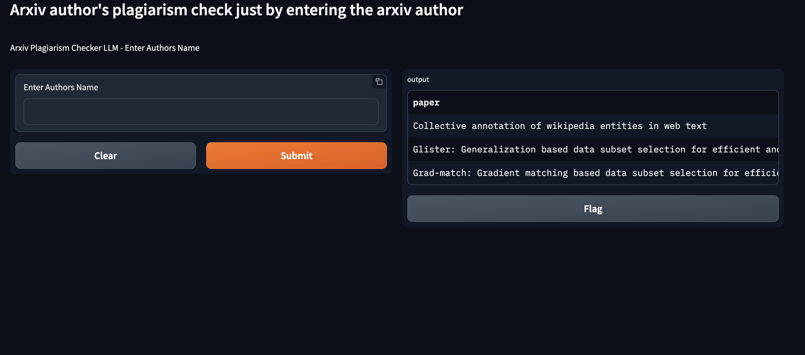

# Arxiv Plagiarism Checker LLM

## end-end-mlops-huggingface

[](https://github.com/gamingflexer/arxiv-plagiarism-checker-llm/actions/workflows/main.yml)


Arxiv author's plagiarism check just by entering the arxiv author

## Demo UI




## Docs

- Miro RoadMap [Link](https://miro.com/app/board/uXjVN8HgXk8=/)

### Research Points

- Notion [Link](https://gamingflexer.notion.site/Arxiv-983d173f46c1426caa9dab319f4ddb3d?pvs=4)

### Top Plagiarism Checkers API

- **[ProWritingAid API V2](https://cloud.prowritingaid.com/analysis/swagger/ui/index) - Free Plan**
- **[Unicheck](https://unicheck.com/plagiarism-checker-api) - Request Demo**
- **Copyleaks** - Free Plan
- EDEN AI - https://www.edenai.co/feature/plagiarism-detection

----

## Requirements

- Python 3.9+
- Gradio
- GPT Keys

## Installation

```bash

```

## Usage

```python

```